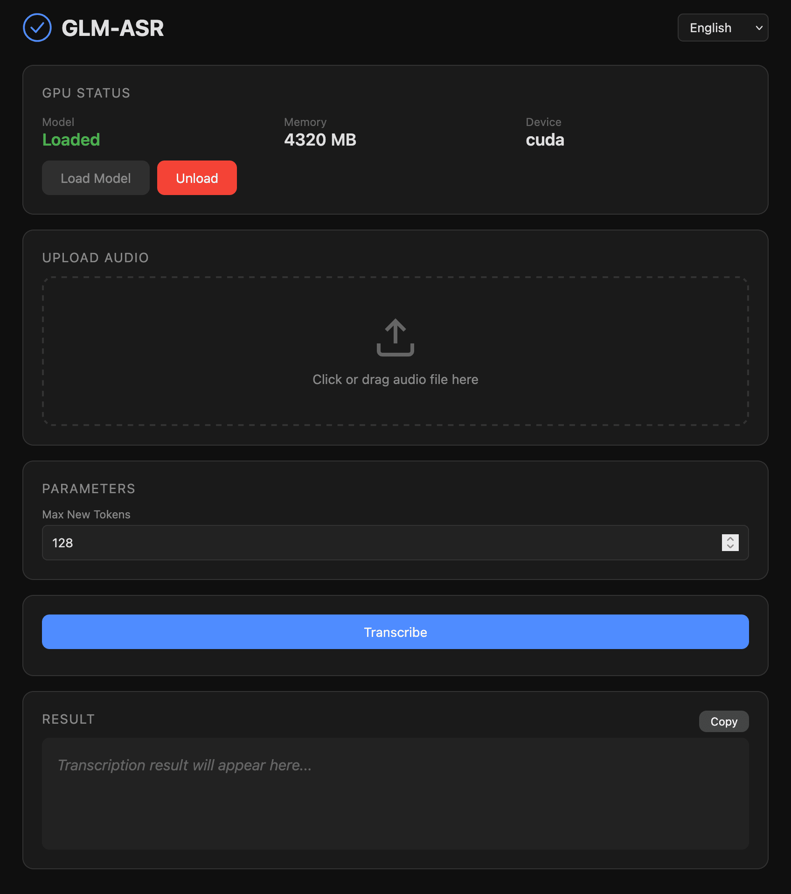

[English](README.md) | [简体中文](README_CN.md) | [繁體中文](README_TW.md) | [日本語](README_JP.md)

<div align="center">


# GLM-ASR

[](https://hub.docker.com/r/neosun/glm-asr)
[](LICENSE)
[](https://python.org)

**All-in-One Speech Recognition Service based on GLM-ASR-Nano**

Web UI • REST API • MCP Server • Long Audio Support

</div>

---

## 🖥️ Screenshot



---

## ✨ Features

- 🎯 **High Accuracy** - Based on GLM-ASR-Nano-2512 (1.5B), outperforms Whisper V3
- 🌍 **17 Languages** - Chinese, English, Cantonese, Japanese, Korean, and more
- 🎤 **Long Audio** - Chunked processing for unlimited audio length
- 🖥️ **Web UI** - Modern dark-mode interface with 4 language support
- 🔌 **REST API** - Full API with Swagger documentation
- 🤖 **MCP Server** - Claude Desktop integration ready
- 💾 **GPU Management** - Manual load/unload for memory control
- 🐳 **Docker Ready** - One-command deployment

---

## 🚀 Quick Start

### Docker (Recommended)

```bash
docker run -d --gpus all -p 7860:7860 neosun/glm-asr:latest
```

Access: http://localhost:7860

### Docker Compose

```bash
git clone https://github.com/neosun100/glm-asr.git
cd glm-asr
docker compose up -d
```

---

## 📦 Installation

### Prerequisites

- NVIDIA GPU with 6GB+ VRAM
- Docker with NVIDIA Container Toolkit
- Or: Python 3.10+, CUDA 12.x, FFmpeg

### Method 1: Docker

```bash
# Pull image
docker pull neosun/glm-asr:latest

# Run with GPU
docker run -d \
  --name glm-asr \
  --gpus all \
  -p 7860:7860 \
  -v ./cache:/app/cache \
  neosun/glm-asr:latest

# Health check
curl http://localhost:7860/health
```

### Method 2: Local Installation

```bash
# Clone repository
git clone https://github.com/neosun100/glm-asr.git
cd glm-asr

# Install dependencies
pip install -r requirements.txt
sudo apt install ffmpeg

# Start service
python app.py
```

---

## ⚙️ Configuration

### Environment Variables

| Variable | Default | Description |
|----------|---------|-------------|
| `MODEL_PATH` | `zai-org/GLM-ASR-Nano-2512` | HuggingFace model path |
| `PORT` | `7860` | Service port |
| `HF_HOME` | `/app/cache` | Model cache directory |

### docker-compose.yml

```yaml
services:
  glm-asr:
    image: neosun/glm-asr:latest
    ports:
      - "7860:7860"
    volumes:
      - ./cache:/app/cache
    deploy:
      resources:
        reservations:
          devices:
            - driver: nvidia
              count: 1
              capabilities: [gpu]
```

---

## 📖 Usage

### Web UI

Open http://localhost:7860 in your browser:
- Upload audio file (wav/mp3/flac/m4a/ogg)
- Click "Transcribe"
- Copy result

---

## 🔌 API Reference

### Base URL
```
http://localhost:7860
```

### Endpoints

#### Health Check
```http
GET /health
```
**Response:**
```json
{"status": "ok", "model_loaded": true}
```

#### Transcribe Audio
```http
POST /api/transcribe
Content-Type: multipart/form-data
```
**Parameters:**
| Name | Type | Required | Description |
|------|------|----------|-------------|
| file | File | Yes | Audio file (wav/mp3/flac/m4a/ogg) |
| max_new_tokens | int | No | Max output tokens (default: 512) |

**Example:**
```bash
curl -X POST http://localhost:7860/api/transcribe \
  -F "file=@audio.mp3"
```
**Response:**
```json
{"status": "success", "text": "Transcribed text here..."}
```

#### GPU Status
```http
GET /gpu/status
```
**Response:**
```json
{
  "model_loaded": true,
  "device": "cuda",
  "checkpoint": "zai-org/GLM-ASR-Nano-2512",
  "gpu_memory_used_mb": 4320.5,
  "gpu_memory_total_mb": 24576.0
}
```

#### Unload Model
```http
POST /gpu/unload
```
**Response:**
```json
{"status": "unloaded"}
```

#### Load Model
```http
POST /gpu/load
```
**Response:**
```json
{"status": "loaded"}
```

### Swagger Documentation
Interactive API docs: http://localhost:7860/docs

---

## 🤖 MCP Server (Claude Desktop)

Add to `claude_desktop_config.json`:

```json
{
  "mcpServers": {
    "glm-asr": {
      "command": "python",
      "args": ["/path/to/glm-asr/mcp_server.py"]
    }
  }
}
```

Available tools:
- `transcribe` - Transcribe audio file
- `gpu_status` - Get GPU/model status
- `gpu_load` - Load model to GPU
- `gpu_unload` - Unload model from GPU

---

## 🏗️ Tech Stack

| Component | Technology |
|-----------|------------|
| Model | GLM-ASR-Nano-2512 (1.5B) |
| Backend | Flask + Flask-SocketIO |
| Frontend | HTML5 + Vanilla JS |
| Container | Docker + NVIDIA CUDA |
| API Docs | Flasgger (Swagger) |
| MCP | FastMCP |

---

## 📊 Benchmark

GLM-ASR-Nano achieves the lowest average error rate (4.10) among comparable models:


---

## 🤝 Contributing

1. Fork the repository
2. Create feature branch (`git checkout -b feature/amazing`)
3. Commit changes (`git commit -m 'Add amazing feature'`)
4. Push to branch (`git push origin feature/amazing`)
5. Open Pull Request

---

## 📝 Changelog

### v1.0.1 (2024-12-14)
- ✅ Added UI screenshot to documentation
- ✅ Enhanced API documentation

### v1.0.0 (2024-12-14)
- ✅ Long audio chunked transcription
- ✅ Web UI with 4 language support
- ✅ REST API with Swagger docs
- ✅ MCP Server integration
- ✅ Docker all-in-one image

---

## 📄 License

[Apache License 2.0](LICENSE)

---

## ⭐ Star History

[](https://star-history.com/#neosun100/glm-asr)

## 📱 Follow Us


